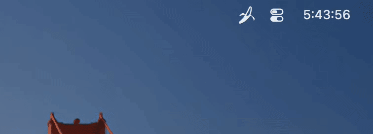

# Link Stripper

A macOS menu-bar utility that watches the clipboard and removes tracking query
parameters (`utm_*`, `fbclid`, `gclid`, YouTube `si`, Amazon `pd_rd_*`, and others)
from links you copy, replacing the clipboard contents with the clean link.

```
https://example.com/post?id=7&utm_source=twitter&fbclid=abc  →  https://example.com/post?id=7
```



- Only acts when the **entire** clipboard is a single valid `http`/`https` URL, meaning a
  plain GET link. Prose containing a link and `mailto:`, `file:`, `javascript:` and other
  schemes are left alone.
- On macOS 15.4 and later it asks the system whether the clipboard looks like a web link
  *before* reading it, so copying anything else is never read.
- Never makes network requests, and runs in the App Sandbox.
- Skips clipboard content that password managers mark as concealed or transient.
- Includes site-specific rules for YouTube, Spotify, X/Twitter, all Amazon storefronts,
  LinkedIn, Facebook, TikTok, Reddit, Google, Bing, eBay, and AliExpress.

See [PRIVACY.md](PRIVACY.md) for the privacy policy.

## Requirements

- macOS 14 (Sonoma) or later
- Xcode, or just the Swift 6 Command Line Tools:

  ```bash
  xcode-select --install
  ```

## Install

```bash
git clone https://github.com/wallace/stripper.git
cd stripper
./build-app.sh
cp -R "build/Link Stripper.app" /Applications/
```

`build-app.sh` compiles a release build with the Command Line Tools and packages it as
an ad-hoc-signed `build/Link Stripper.app`. To build the sandboxed App Store version
instead, open `LinkStripper.xcodeproj` in Xcode.

## Run

```bash
open "/Applications/Link Stripper.app"
```

Link Stripper runs in the menu bar (banana icon) with no Dock icon. The banana flashes in
colour each time a link is cleaned. The menu has these items:

| Item | What it does |
| --- | --- |
| Clean Copied Links | Turn cleaning on or off |
| Show Notifications | Show a banner each time a link is cleaned (off by default; macOS asks for permission the first time) |
| Launch at Login | Start Link Stripper automatically when you log in |
| Copy Last Original Link | Put the last original, uncleaned link back on the clipboard (useful if a cleaned link breaks) |
| Stop Clipboard Prompts… | Shown when macOS is set to ask before Link Stripper reads copied links; explains how to allow it |
| Quit Link Stripper | Quit the app |

### Clipboard permission

macOS 15.4 and later can ask before an app reads what you copied in another app. If you
see that prompt, set Link Stripper to **Allow** in System Settings › Privacy & Security ›
Paste from Other Apps so links are cleaned without asking each time.

To try it, copy a tracking link and paste it anywhere:

```bash
printf 'https://example.com/?id=1&utm_source=test' | pbcopy; sleep 1; pbpaste
```

### Uninstall

Turn off Launch at Login if you enabled it, quit Link Stripper from its menu, then delete
`/Applications/Link Stripper.app`.

## Development

Tracking rules live in [`Sources/StripperCore/TrackingRules.swift`](Sources/StripperCore/TrackingRules.swift);
validation and cleaning are in [`URLCleaner.swift`](Sources/StripperCore/URLCleaner.swift).

The app icon and menu bar glyphs are drawn by [`Resources/banana.py`](Resources/banana.py);
`Resources/make-icon.sh` regenerates `Resources/Assets.xcassets` and `AppIcon.icns`
(needs `brew install librsvg`). The generated files are committed.

The Xcode project is generated from [`project.yml`](project.yml) with
[XcodeGen](https://github.com/yonaskolb/XcodeGen) (`xcodegen generate`). The generated
`LinkStripper.xcodeproj` is committed, so XcodeGen is only needed when `project.yml` changes.

Run the tests with Xcode selected (`xcode-select -s /Applications/Xcode.app`):

```bash
swift test
```

With only the Command Line Tools, point the compiler at the Swift Testing macro plugin:

```bash
swift test -Xswiftc -plugin-path -Xswiftc /Library/Developer/CommandLineTools/usr/lib/swift/host/plugins/testing
```

## Releasing to the Mac App Store

See [docs/app-store.md](docs/app-store.md).

## Acknowledgements

Link Stripper itself contains no third-party code: the app uses only Apple's system
frameworks and the Swift runtime that ships with macOS. It is built with these open-source
projects, with thanks to their authors:

| Project | Used for | License |
| --- | --- | --- |
| [Swift](https://www.swift.org) | Language, compiler and standard library | Apache 2.0 with Runtime Library Exception |
| [Swift Testing](https://github.com/swiftlang/swift-testing) | Unit tests | Apache 2.0 with Runtime Library Exception |
| [XcodeGen](https://github.com/yonaskolb/XcodeGen) | Generating `LinkStripper.xcodeproj` from `project.yml` | MIT |
| [librsvg](https://gitlab.gnome.org/GNOME/librsvg) (`rsvg-convert`) | Rendering the icon SVGs to PNG | LGPL 2.1 or later |
| [Python](https://www.python.org) | Running `Resources/banana.py`, which draws the icons | PSF License |

None of these tools are distributed with the app.

## License

Link Stripper is released under the [MIT License](LICENSE). The banana artwork in
`Resources/` is covered by the same license.
